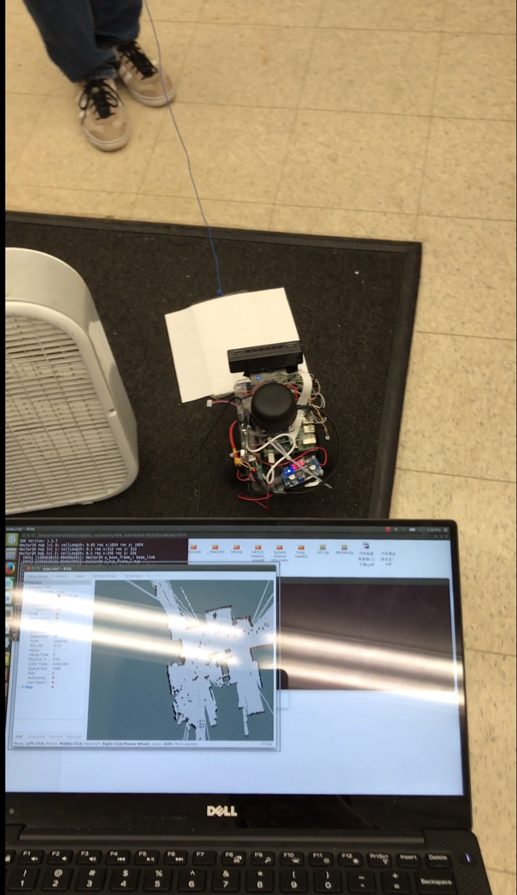
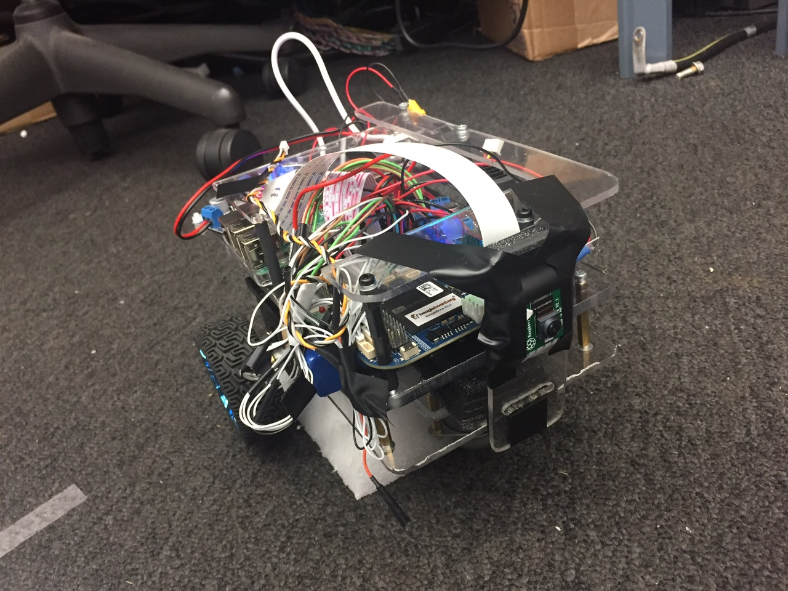
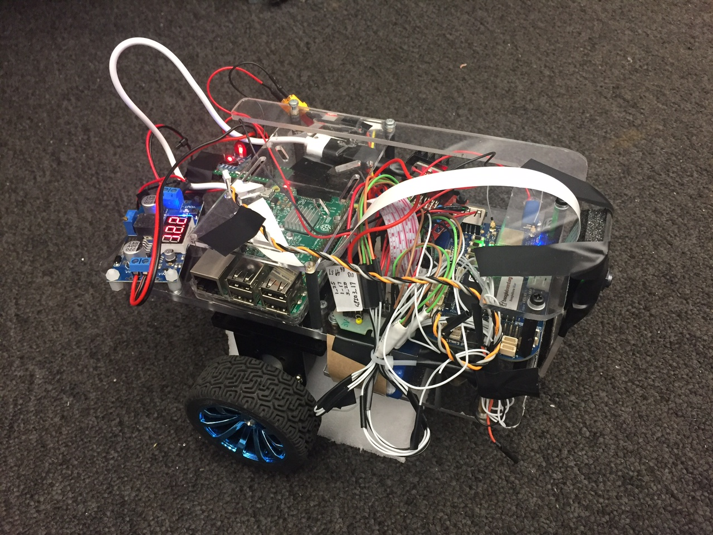
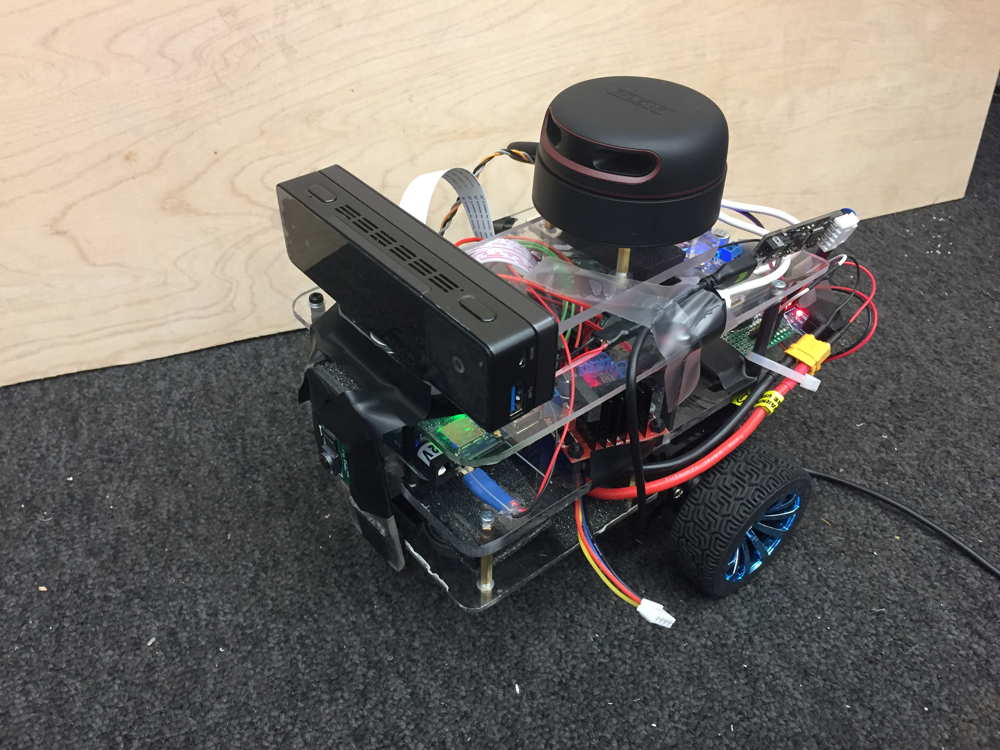
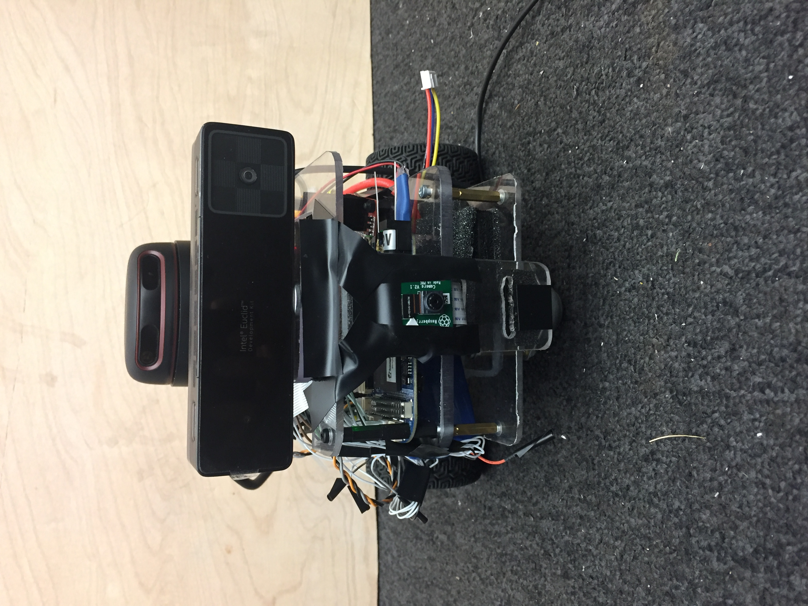
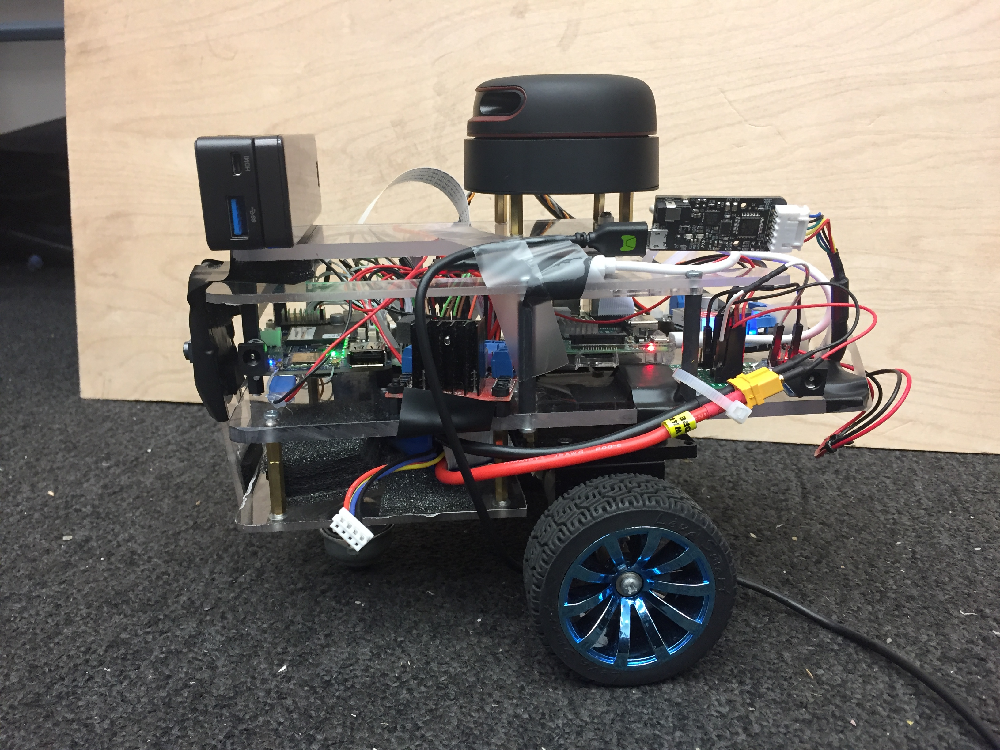

# Autonomous robot platform for algorithm development research 

This is a demo repo for autonomous robot research.

    

## Demo Videos

### BBBlue path following robust test

[Robot running a square](https://youtu.be/SS_GgtZsr1g)

[Disturbance resistance](https://youtu.be/tviMtRldPG8)

### Lane detection and mapping

What robot looks like in this stage:

    
    

Use BBBlue and RPi and Picamera for simple RGB function:

[Lane detection for autonomous robot mapping exploration demo 1](https://youtu.be/K5EtviDAQok)

[Lane detection for autonomous robot mapping exploration demo 2 (GUI on PC end)](https://youtu.be/bkLq2cbF-zA)

### SLAM demo

What robot looks like in this stage:

    
    
    

Use RPLIDAR for Hector SLAM function:

[Hector SLAM demo](https://youtu.be/ehYfVyNUKOA)

## Repo Status

Still under initial development. Will commit more in near future. (8/13/2017)

The purpose for this project is to study more techs recently used in robotics and autonomous driving. So for complexity, there are certain area I use more than one way to realize a simple function. For example, I use hybrid robotics communication system, both LCM and ROS. For visual SLAM, I use both Intel Realsense ZR300 and Microsoft Kinect.

## File System Explanation

* ./bot: BBBlue
* ./bot_perception: RPi
* ./bot_euclid: Euclid

## Hardware Architecture

The reason I chose these hardware is: 
Users can also use different motor driver and motor set, and they only need to modify the code for the driver in `setup_motors()`, `init_motor()` function to change pin connection, motor driver direction definition and motor driver enable. They also need to change the `set_motor_speed()` function depends on if they motor has inner loop controller for PWM-speed mapping relationship.

By the way, for robotics design ideas, I found [this video](https://youtu.be/OJNNm6iMOKk) inspiring and may give you more descriptions on the small robot design.

### Hardware List

* RPLIDAR and UART-USB converter
* Intel Realsense Euclid development kit
* Microsoft Kinect
* Beaglebone Blue
* Raspberry Pi 3
* Picamera
* Spektrum transmitter DX6 and satellite receiver
* Brush DC motor and motor driver L298
* Voltage regulator module

### Hardware Integration

    

## Software Architecture

Logic design structure:
* **Perception:** Picamera(R), encoder(B), IMU(B), Realsense camera(E), Kinect, Lidar(R or E)
* **Desision Making:** 
* **Actuation:** GPIO(B), Motor(B)

Real design structure:
* **Lower Level System**

DSM X: function switch and mannual control for the movement of robot. Use Spektrum transmitter and satellite receiver.

* **Higher Level System**

## Communication Architecture

There are more supportive packages for ROS. LCM is lightweight.

### [LCM (Lightweight Communications and Marshalling)](https://lcm-proj.github.io/)

### [ROS (Robotics Operating System)](http://www.ros.org/)

## Odometry

* **Encoder**
* **IMU**
* **Gyrodometry**
* **Visual Odometry**

## Path Planning

## Lane Cruising

## Visual SLAM
Open source will be implemented: ORB-SLAM; Open RatSLAM; OKVIS.

## Lidar SLAM
Open source will be implemented: Hector SLAM; gMapping; Cartographer.

For Lidar SLAM research, [RPLIDAR A2](https://www.slamtec.com/en/Lidar) is used in this project.

[RPLIDAR support page](https://www.slamtec.com/en/Support) provides some documents and manuals.

In official [RPLIDAR ROS Repo](https://github.com/robopeak/rplidar_ros.git), checkout `slam` branch. And git clone other SLAM packages in catkin_ws/src. We use [Hector slam](https://github.com/tu-darmstadt-ros-pkg/hector_slam.git) and [gMapping slam](https://github.com/ros-perception/slam_gmapping.git).

## SLAM Mapping Assistance System

## Point Cloud flitering, sugmentation, clustering and recognition

## License

autonomous-robot is distributed under the [MIT license](./LICENSE).